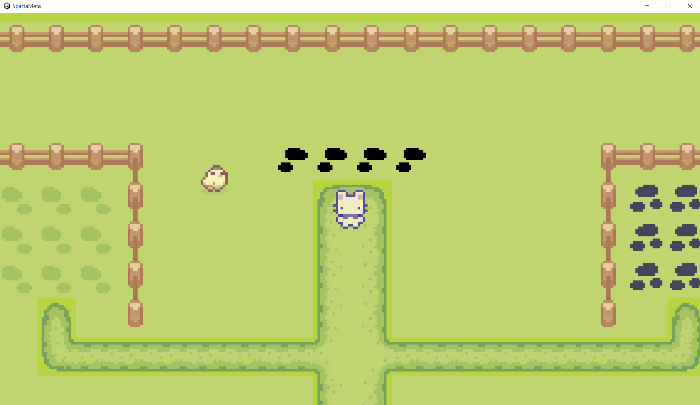

# SpartaMeta
 
스파르타 코딩클럽 과제용 레포

강의자료를 한 번 다 따라해보고 과제를 하려니
과제 프로젝트 내에서 다시 Flappy 게임을 만드는 데에 
시간을 꽤나 많이 써서 정작 본프로젝트에 기능을 제대로
구현을 하지 못 한 거 같다. 

미니게임을 시작하는 것도 아예 다른 게임으로 넘어가는 느낌이라 
많이 조잡해보이는 것도 같다.

[ Assets -From : Sprout Lands -By : Cup Nooble ]
[ Assets -From : https://kenney.nl/assets/tappy-plane]
