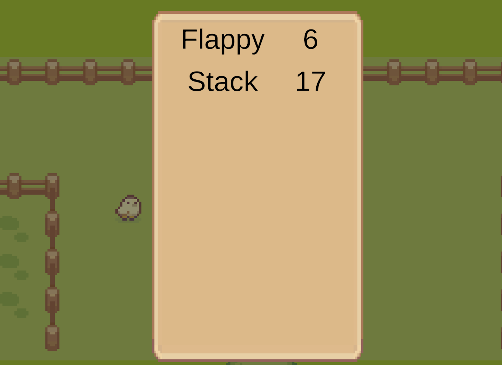

# SpartaMeta
 
스파르타 코딩클럽 과제용 레포

위쪽은 리더보드, 왼쪽은 스택 미니게임, 오른쪽은 플래피 미니게임

강의자료를 한 번 다 따라해보고 과제를 하려니
과제 프로젝트 내에서 다시 Flappy 게임을 만드는 데에 
시간을 꽤나 많이 써서 정작 본프로젝트에 기능을 제대로
구현을 하지 못 한 거 같다. 

미니게임을 시작하는 것도 아예 다른 게임으로 넘어가는 느낌이라 
많이 조잡해보이는 것도 같다.

병아리 근처에 가면 대화창이 뜬다. 이외 상호작용은 구현 못 했다.

위쪽 공간에 들어가면 점수 기록들이 보인다.

좌우 공간에 올라서면 어떤 게임인 지 보인다.

스택게임은 해상도를 변경해보았다.

[ Assets -From : Sprout Lands -By : Cup Nooble ]

[ Assets -From : https://kenney.nl/assets/tappy-plane]
